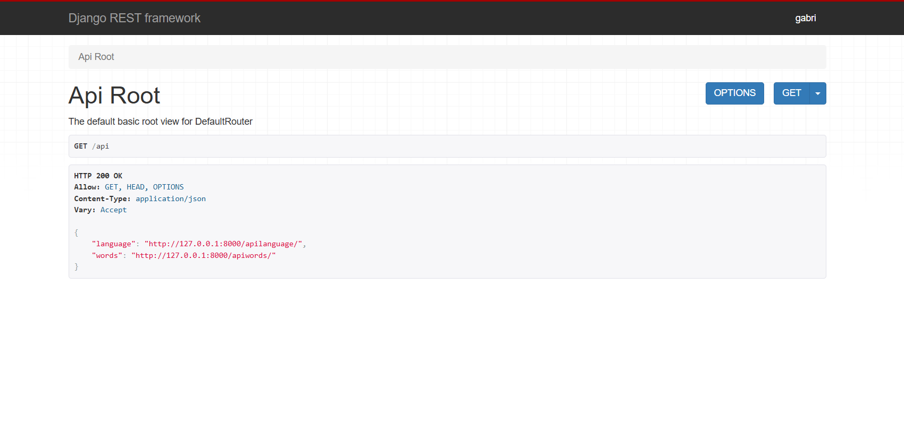
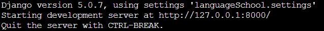

# CRIAÇÃO DE UM PROJETO DJANGO:

Para criar um projeto django, abra o terminal e digite:

```
django-admin startproject myproject
```
Em seguida, acesse o projeto que você utilizou:
```
cd myproject
```
O comanda `cd`é uma abreviação para "change directory" ("mude diretório"... pasta). 

Depois de criar o peojeto, a estrutura de arquivos ficará algo como:



Para verificar se o projeto está propriamente funcionando, você pode digitar o comando:
```
python manage.py runserver
```
Esse comando irá rodar o servidor. Essa mensagem irá aparecer indicando o sucesso:
<br>



# CONFIGURAÇÃO DO DJANGO:

O Django é um framework integrado, ou seja, te oeferece materiais para montar tanto o BACK-END quanto o FRONT-END. Mas, para este projeto, iremos nos limitar apenas ao back-end já que para o design dos componentes iremos utilizar a biblioteca React do Java-Script. 

## CONDIGURANDO O BANCO DE DADOS NO DJANGO:

Nada muito complicado. É apenas necessário descrever para o django como a conexão será estabalecida, a rota, qual o driver e qual o banco de dados usado.

- dentro do arquivo `settings.py` esvreca o seguinte:

```python
# No mysql-client digite o comando (CREATE DATABASE langschool).
DATABASES = {
    'default': {
        'ENGINE': 'django.db.backends.mysql',
        'NAME': 'langschool',
        'USER': 'root',
        'PASSWORD': 'Gabriel123!',
        'HOST': '127.0.0.1',
        'PORT': '3306',
    }
}
``` 
*lembre de criar o banco de dados, antes disso*

Dentro do mesmo arquivo, descreva ao django quais aplicativos e outros sistemas farão parte de sua aplicação. Isso inclui o nome do aplicativo que estamo criando. 

```python
INSTALLED_APPS = [
    'django.contrib.admin',
    'django.contrib.auth',
    'django.contrib.contenttypes',
    'django.contrib.sessions',
    'django.contrib.messages',
    'django.contrib.staticfiles',
    'rest_framework',
    'languageSchool',
    
]
```
Após configurar o banco de dados, indique ao django as migrações necessárias. Digite em seu terminal:
```
python manage.py migrate
```

# CRIANDO O APLICATIVO:

A estrutura central criada até agora não é uma aplicação Django, é apenas a estrutura onde o APP será feito. Para iniciar o seu projeto é necessário criar um Django-APP, e para isso basta digitar:

```
django-admin startproject nome_do_projeto
```
No nosso caso, digite o nome do projeto

```
django-admin startproject language
```

Em seguida, adicione o nome do APP ao `INSTALLED_APPS` no arquivo `settings.py`.

```
INSTALLED_APPS = [
    'django.contrib.admin',
    'django.contrib.auth',
    'django.contrib.contenttypes',
    'django.contrib.sessions',
    'django.contrib.messages',
    'django.contrib.staticfiles',
    'rest_framework',
    'languageSchool',
    'languages'
]
``` 