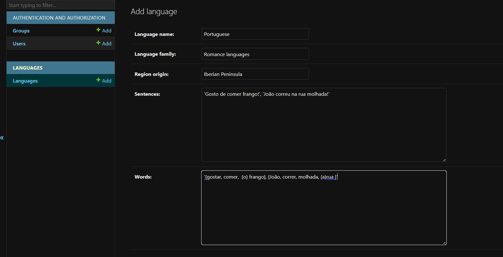

# MODELS:

A palavra 'model' em inglês, como o nome já sugere, significa modelo. Modelo é o nome dado para o conjunto da aplicação onde os dados principais, assim como seus comportamentos, serão descritos. De uma maneira geral, modelos são compostos por:

***MODELO***:
- Entidades 
- SERVIÇOS
- DADOS

No entanto, em um projeto Django, tudo isso está encapsulado diretamente no conceito Model em si, ou seja, sempre que no contexto de python/django você encontrar este termo, pense nesses três conceitos, juntos.

## CRIANDO O MODELO 'LANGUAGE':

O intuito de nosso projeto será criar um protótipo bem simples de uma escola de idiomas. Nela teremos alunos e turmas relacionados a diferentes linguas do mundo. 

Cada aluno, usuário de nossa aplicação, será composto por:

- id (matrícula) 
- login
- senha
- cursos (línguas)
- matriculado?
- notas

Cada curso (Língua) será composto por:

- nome da língua
- família da língua
- país/região onde se fala
- sentenças (frases aprendidas pelo aluno)
- palavras (palavras aprendidas pelo aluno)

De início, o modelo da model ficará o seguinte:
```python
from django.db import models

class Language(models.Model):

    language_name = models.CharField(max_length=250)
    language_family = models.CharField(max_length=250)
    region_origin = models.CharField(max_length=250)
    sentences = models.TextField()
    words = models.TextField()

    def __str__(self) -> str:
        return self.language_name
```

Dessa forma podemos calaramente representar um curso. É importante lembrar que um único curso é capaz de conter diversos alunos... Mas isso definiremos em outra parte.


# ADMIN

A maioria das aplicações no ambiente web possuem a funcionalidade de delegar certa parcela de seu controle, ou a totalidade dele,  a uma entidade com poderes administrativos. O ADMIN possui certos acessos a privilégios relacionadas a aplicação...
No Django, esse é o conceito chamado de 'super-user', vamos ver como criar um.

```
python manage.py createsuperuser 
```
No terminal irá aparecer mensagens pedindo definição de credenciais como: nome, email e senha, por exemplo. Após definir tudo isso seu usuário está criado!

Mas, calm! Precisamos ainda modificar o arquivo que nos dá acesso a funcionalidade administrativa, além de defini-la.

No arquivo `admin.py` de seu Django-APP


```python 
from django.contrib import admin
from .models import Language

admin.site.register(Language)
```
Com a escrita acima estamos registrando a `model` `Language` na interface administrativa do Django, já que criamos o super-user poderemos acessa-la diretamente da interface.

Com o super-user criado, é possível, finalmente, acessar o servidor mais uma vez. Agora, teremos acesso ao painel do administrador oferecido pelo Django, possibilitando a manipulação de dados e informações (CRUD). (Create, read, update, delete)


## ACESSANDO A INTERFACE DO ADMINISTRADOR:

Abra o seu terminal a rode o servidor:

```
python manage.py runserver
```
O seguinte irá aparecer:


Clique no link indicado pela mensagem em seu terminal:


Quando a página web for iniciada, altere a URL. 


Para acessar a interface do administrador basta adicionar `/admin`ao final de sua URL ao abrir a página do servidor.


Digite suas credenciais e pront! Você poderá interagir diretamente com os dados, possuindo acesso total ao seu repositório. :)

Clique no botão `+Add` que se encontra próximo a `Languages` e adicione qualquer coisa que faça sentido...



PERFEITO! Uma nova entidade foi adicionada ao banco de dados.


